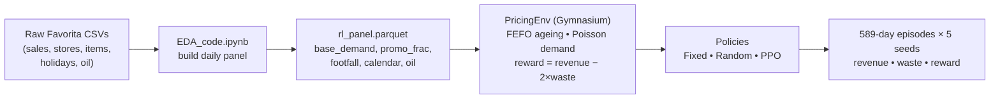

# Dynamic Pricing for Food Waste Reduction in Supermarkets using Reinforcement Learning


A reproducible reinforcement-learning study that asks a practical question: can a learned
pricing policy cut **food waste** on perishable supermarket goods without sacrificing
revenue, compared to the fixed and markdown pricing most retailers actually use?

A custom **Gymnasium** environment simulates FEFO inventory ageing, stochastic demand and
discrete price multipliers. A **PPO** agent (Stable-Baselines3) is trained and benchmarked
against Fixed-price and Random-price baselines over 589-day episodes across 5 random seeds.

> MSc Research Project, MSc in Data Analytics, National College of Ireland.

---

## Headline result

Averaged across 5 seeds (589-day episodes), with reward = revenue − 2 × waste:

| Policy | Total revenue | Total waste (units) | Total reward |
|--------|--------------:|--------------------:|-------------:|
| Fixed  | 246,090 | 43,703 | 158,684 |
| Random | 218,962 | 6,774  | 205,414 |
| **PPO** | 203,183 | **0** | 203,183 |

**PPO reached zero expired units on every seed** while staying revenue-competitive. The
Fixed baseline earns the most top-line revenue but wastes ~44K units, which is operationally
unsustainable for perishables.

*Honest caveat:* with the lenient waste penalty (2×) used here, the Random policy occasionally
edges PPO on raw reward, and statistical power is limited (n = 5 seeds, no confidence
intervals). PPO is the only policy that consistently achieves zero waste; a stiffer penalty
would push the reward advantage decisively to PPO.

## How it works



- **Environment** (`env_pricing_sample.py`): single perishable product family, discrete price
  multipliers `{0.5, 0.7, 1.0, 1.1}`, FEFO inventory buckets, Poisson demand with price
  elasticity and promotion/holiday lift, reward that penalises expired units.
- **Baselines:** Fixed (always base price) and Random (uniform over actions).
- **Agent:** PPO (`MlpPolicy`), trained with Stable-Baselines3.

## Repository structure

```
.
├── README.md
├── environment.yml              # conda env (cross-platform)
├── env_pricing_sample.py        # PricingEnv — the Gymnasium environment
├── EDA_code.ipynb               # raw CSVs -> daily panel (rl_panel.parquet)
└── rl_training_code.ipynb       # train PPO, evaluate vs Fixed/Random, plots & tables
```

## Dataset

Corporación Favorita Grocery Sales Forecasting (Kaggle):
https://www.kaggle.com/datasets/ruiyuanfan/corporacin-favorita-grocery-sales-forecasting

The raw CSVs (`train.csv`, `test.csv`, etc.) are **not** committed — `train.csv` alone is
several hundred MB. Download them from the link above and place them beside the notebooks.

## How to run

```bash
# 1. Create and activate the environment
conda env create -f environment.yml
conda activate rl_pricing

# 2. Launch Jupyter
jupyter notebook
```

1. Run **`EDA_code.ipynb`** end-to-end — it builds the daily panel and writes
   `rl_panel.parquet` beside the notebook.
2. Run **`rl_training_code.ipynb`** — it imports `PricingEnv` from `env_pricing_sample.py`,
   loads the panel, trains PPO, evaluates all three policies, and produces the comparison
   tables and plots.

Keep `env_pricing_sample.py` in the same folder as the training notebook, or you'll get
`ImportError: No module named 'env_pricing_sample'`.

## Configuration knobs

All simulator behaviour is set in the `PricingEnv` constructor: `price_multipliers`,
`elasticity`, `shelf_life`, `safety_stock_factor`, `waste_penalty`, `max_inventory`,
`random_seed`.

## Author

**Sathwik Kataradahalli Sumanth** — MSc Data Analytics, National College of Ireland
[LinkedIn](https://linkedin.com/in/sathwik-k-s-88964b286) · [GitHub](https://github.com/Sathwik-0102)
